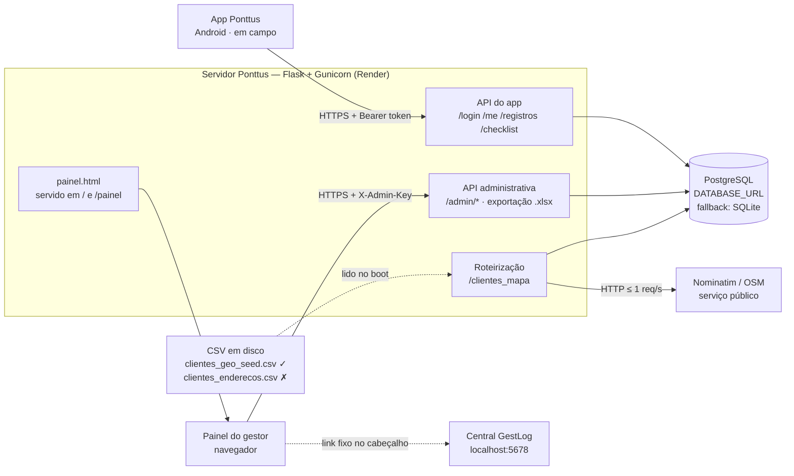
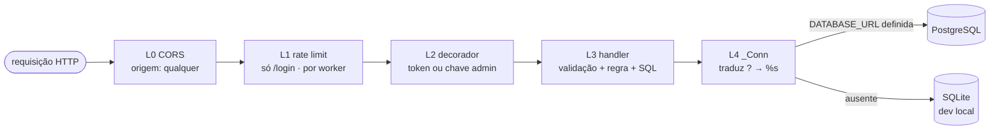
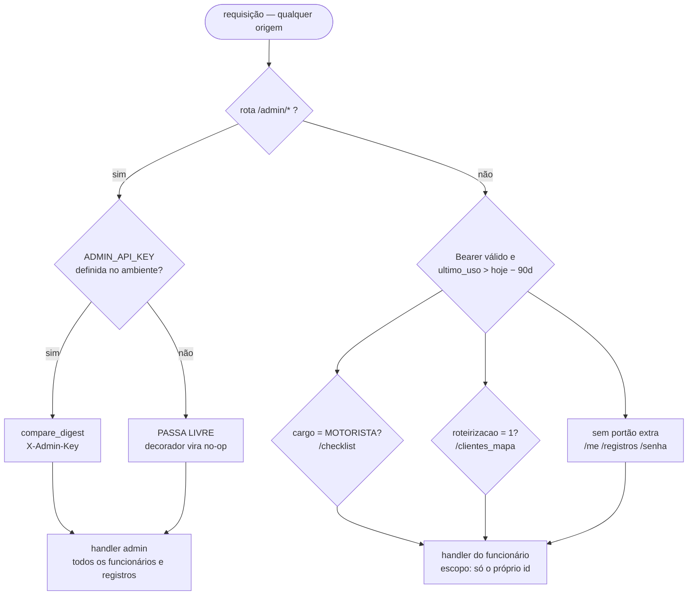
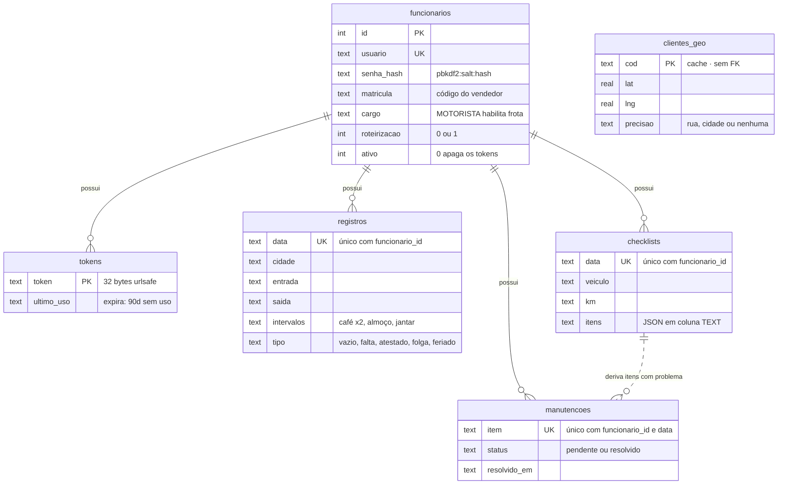
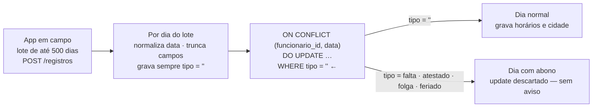
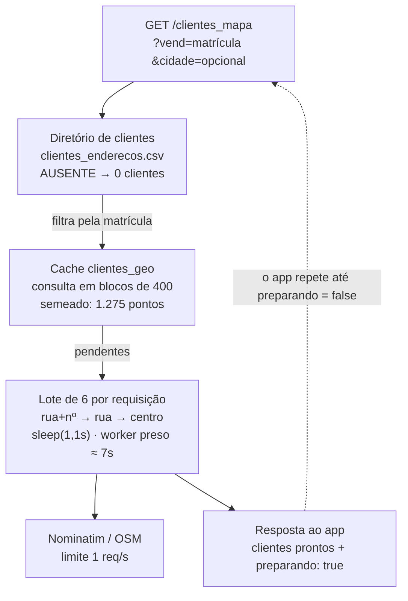
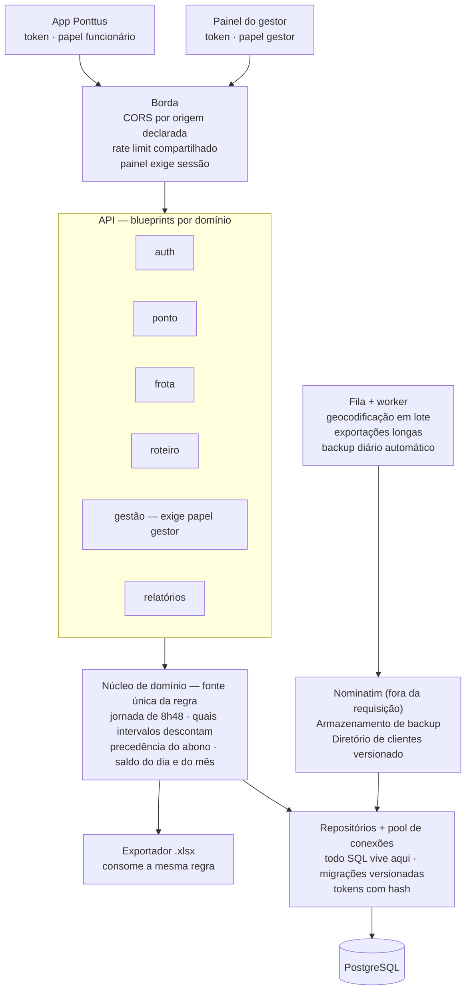

# Ponttus — Arquitetura

Documento de arquitetura do servidor Ponttus (GestLog): como o sistema é hoje,
onde estão as fragilidades e para onde ele deve evoluir.

Levantado a partir de `app.py`, `templates/painel.html` e do esquema criado por
`init_db()`. Toda afirmação aqui corresponde ao código desta branch.

| | |
|---|---|
| Serviço | 1 processo Flask (`app.py`, 1184 linhas) |
| Rotas HTTP | 19 |
| Tabelas | 6 |
| Bancos suportados | PostgreSQL (produção) · SQLite (local) |
| Sistemas de autenticação | 2, independentes entre si |

---

## 1. Contexto

O Ponttus é um sistema de **controle de ponto para trabalho externo**. Vendedores e
motoristas registram jornada, cidade e intervalos pelo aplicativo; motoristas também
enviam o checklist do veículo; o gestor fecha o mês numa planilha no modelo oficial
da empresa. Tudo converge para um único servidor.

O painel administrativo não tem servidor próprio: é HTML servido pela mesma
aplicação, que chama as rotas `/admin/*` a partir do navegador do gestor.

O app é **offline-first**: acumula os dias no aparelho e envia em lote quando há rede.

> **Achado:** `clientes_enderecos.csv`, que alimenta a roteirização, **não existe no
> repositório**. Sem ele, `/clientes_mapa` devolve zero clientes em qualquer ambiente novo.

---

## 2. Anatomia do núcleo

O servidor é um módulo só, sem camadas declaradas — mas com camadas de fato, porque
toda requisição atravessa a mesma sequência. Nomeá-las é o primeiro passo para separá-las.

| Camada | Responsabilidade | Estado |
|---|---|---|
| **L0 — Borda** | `CORS(app)` sem restrição de origem; TLS pela plataforma | sem proteção adicional |
| **L1 — Rate limit** | dicionário em memória `{ip: [timestamps]}`, 10/min | só `/login`, por worker |
| **L2 — Autenticação** | `@require_token` (Bearer) e `@require_admin_key` (chave estática) | dois sistemas disjuntos |
| **L3 — Handlers** | 19 rotas que validam, aplicam regra e montam SQL na mesma função | sem camada de serviço |
| **L4 — Adaptador `_Conn`** | mesma API para SQLite e Postgres; traduz `?` → `%s` | a melhor peça do código |
| **L5 — Persistência** | Postgres se `DATABASE_URL`, senão SQLite | uma conexão por requisição, sem pool |

Dois detalhes de implantação que decorrem disso:

- Cada requisição abre e fecha a própria conexão — **não há pool**.
- `init_db()` roda na importação do módulo, ou seja, **uma vez por worker do Gunicorn,
  em paralelo**. As migrações são idempotentes e protegidas por `try/except`, então
  funcionam; mas a semeadura das 1.275 coordenadas pode ser tentada por vários workers
  ao mesmo tempo.

---

## 3. Identidade e permissões

Esta é a decisão arquitetural mais consequente do sistema — e a que mais precisa mudar.
Existem **dois sistemas de autenticação que não se conhecem**:

- **Funcionário** — `POST /login` com usuário e senha devolve um token opaco de 32 bytes,
  gravado em `tokens`. Expira após 90 dias *sem uso* (janela deslizante: cada requisição
  atualiza `ultimo_uso`).
- **Gestor** — não faz login. Digita uma chave estática no painel, guardada em
  `localStorage` e enviada em `X-Admin-Key` a cada chamada.

Consequências:

- O usuário `admin` existe como linha em `funcionarios` e consegue fazer login pelo app,
  mas esse login **não dá acesso a nenhuma rota `/admin/*`**.
- Se `ADMIN_API_KEY` não estiver definida, o decorador vira uma função vazia e **todas as
  rotas administrativas ficam abertas**.
- A chave é compartilhada: nenhuma ação administrativa é atribuível a uma pessoa.

### Superfície de rotas

| Rota | Método | Proteção | Observação |
|---|---|---|---|
| `/login` | POST | pública | 10 tentativas/min por IP, por worker |
| `/ping` | GET | pública | revela qual banco está em uso |
| `/` e `/painel` | GET | pública | HTML do painel servido sem autenticação |
| `/me` | GET | token | dados atuais do funcionário |
| `/senha` | POST | token | exige a senha atual; mínimo 6 caracteres |
| `/registros` | POST | token | lote de até 500; ignora o id do payload |
| `/registros` | GET | token | `?mes=YYYY-MM`, ou últimos 120 |
| `/checklist` | POST · GET | token + cargo | só `cargo = MOTORISTA` |
| `/clientes_mapa` | GET | token + flag | só admin ou `roteirizacao = 1` |
| `/admin/funcionarios` | GET · POST · PUT | chave | desativar apaga os tokens do funcionário |
| `/admin/registros` | GET | chave | sem paginação — o mês inteiro de todos |
| `/admin/abono` | POST | chave | falta · atestado · folga · feriado |
| `/admin/checklists` | GET | chave | filtro por mês |
| `/admin/manutencoes` | GET | chave | pendente · resolvido · todos |
| `/admin/manutencoes/resolver` | POST | chave | resolve ou reabre |
| `/admin/exportar` | GET | chave | planilha no modelo oficial |

---

## 4. Modelo de dados

Seis tabelas. Cinco giram em torno de `funcionarios`; `clientes_geo` é uma ilha — cache
puro, sem relação com o resto. Datas e horas são **texto** nos dois bancos
(`YYYY-MM-DD` e `HH:MM`), escolha deliberada para que comparação e ordenação se
comportem igual em SQLite e Postgres.

Dois pontos que o diagrama não mostra sozinho:

- Os índices únicos `(funcionario_id, data)` são o que torna o envio do app
  **idempotente**: reenviar o mesmo dia atualiza em vez de duplicar. É a solução do
  offline-first, e ela mora no banco.
- A ligação entre funcionário e carteira de clientes **não é uma chave estrangeira**: é a
  `matricula` procurada dentro da coluna `vendedores` do CSV, separada por `;`.

---

## 5. Fluxos críticos

### 5.1 Sincronização do ponto

O servidor faz `INSERT … ON CONFLICT DO UPDATE` com uma cláusula que carrega toda a
política do sistema: **o abono lançado pelo gestor prevalece sobre o que o funcionário envia**.

> **Achado:** a resposta devolve `salvos` = número de dias *recebidos*, não de dias
> efetivamente gravados. O app confirma ao funcionário uma escrita que o banco recusou.

### 5.2 Checklist gera manutenção

Único lugar onde um registro do funcionário produz automaticamente trabalho para outra
pessoa. Ao salvar o checklist, o servidor recalcula as pendências do dia: item marcado
como `problema` vira linha em `manutencoes`; item que deixou de ser problema tem a
pendência apagada — **mas só se ainda estiver `pendente`**. Manutenções já resolvidas
sobrevivem à correção do checklist, o que preserva o histórico.

### 5.3 Roteirização e geocodificação

O fluxo mais caro, e o único que chama a rede externa. Foi desenhado para caber no
*timeout* de uma requisição HTTP: no máximo 6 endereços por chamada, 1,1 s entre
requisições ao Nominatim, devolvendo `preparando: true` para o app perguntar de novo.

É um *job* em lote disfarçado de requisição HTTP — ele existe porque não há worker
assíncrono. Uma carteira de 300 clientes novos leva 50 chamadas e ocupa um worker por
cerca de 6 minutos acumulados.

### 5.4 Fechamento do mês

`GET /admin/exportar?mes=YYYY-MM` monta a planilha oficial com openpyxl: um bloco de 42
linhas por funcionário ativo, todos os dias do mês pré-preenchidos, abonos escritos por
extenso na coluna do local, e o total do dia como **fórmula Excel** — não como valor
calculado. A planilha continua sendo o documento de verdade da empresa; o servidor a
reproduz, não a substitui.

---

## 6. A regra da jornada mora em dois lugares

A jornada é de 8h48 (528 minutos). Essa regra está implementada **duas vezes, em
linguagens diferentes, e as duas discordam**. O servidor não implementa nenhuma: só
armazena e transporta.

Para um mesmo dia — entrada 07:00, almoço 12:00–13:00, jantar 19:00–20:00, saída 21:00:

| Implementação | Cálculo | Resultado |
|---|---|---|
| `painel.html · calcHoras()` | saída − entrada − almoço (ignora jantar e cafés) | **13h00** |
| `/admin/exportar` · fórmula na célula | `(G−D)+(K−H)+(M−L) − 8:48` (desconta almoço e jantar) | **12h00** |

A diferença é exatamente o intervalo do jantar. O banco guarda quatro intervalos (café da
manhã, almoço, café da tarde, jantar); o painel desconta um, a planilha desconta dois, e
nenhum dos dois desconta os cafés.

> **Decisão que o negócio precisa tomar antes de qualquer código:** o intervalo de jantar
> e os cafés descontam da jornada? A resposta define qual implementação está certa — e ela
> deve virar uma única função no servidor, consumida pelo painel e pela exportação.

---

## 7. Implantação e ambiente

Implantação por *push*: o Render observa o repositório, instala `requirements.txt` e sobe
o Gunicorn. **Não há `Procfile`, `render.yaml`, Dockerfile nem CI no repositório** — a
configuração vive no painel do Render, fora do controle de versão.

| Variável | Efeito se ausente | Risco |
|---|---|---|
| `DATABASE_URL` | cai para SQLite em disco efêmero — **dados somem no próximo deploy** | alta |
| `ADMIN_API_KEY` | todas as rotas `/admin/*` ficam abertas | alta |
| `ADMIN_PASSWORD` | senha aleatória impressa *uma única vez* no log de build | média |
| `PORT` · `HOST` | 5000 / 0.0.0.0 — irrelevante sob Gunicorn | baixa |
| `FLASK_DEBUG` | desligado, que é o correto | baixa |

O painel carrega do navegador do gestor duas dependências externas: a fonte Inter pelo
Google Fonts e a biblioteca `xlsx` pelo cdnjs. Sem elas, o painel perde a tipografia e
todos os botões de exportação do lado do cliente.

---

## 8. Riscos e dívidas, em ordem de consequência

| # | Achado | Consequência | Sev. |
|---|---|---|---|
| 1 | `ADMIN_API_KEY` vazia desliga o decorador; `CORS(app)` aceita qualquer origem | base de funcionários e registros exposta a quem souber a URL | **alta** |
| 2 | Chave admin única, estática, em `localStorage`, sem expiração | nenhuma ação administrativa é atribuível a uma pessoa | **alta** |
| 3 | Regra da jornada duplicada e divergente (seção 6) | painel e planilha fecham o mesmo mês com totais diferentes | **alta** |
| 4 | `clientes_enderecos.csv` fora do repositório | roteirização devolve zero clientes em ambiente novo | **alta** |
| 5 | Backup é clique manual no painel, gerando .xlsx no navegador | recuperação depende de alguém ter lembrado | **alta** |
| 6 | `sleep(1,1s)` síncrono dentro do handler de roteirização | worker preso ~7s por chamada; poucos usuários esgotam o serviço | média |
| 7 | Conexão nova a cada requisição, sem pool | latência e consumo de conexões crescem com o tráfego | média |
| 8 | Rate limit em memória, por worker, só no `/login` | limite real é 10 × nº de workers, e zera a cada deploy | média |
| 9 | `_login_attempts` nunca descarta IPs antigos | crescimento lento e permanente de memória | média |
| 10 | `GET /admin/registros` sem paginação nem filtro obrigatório | o backup puxa a tabela inteira numa resposta só | média |
| 11 | Tokens guardados em texto puro | um dump do banco entrega sessões ativas prontas | média |
| 12 | `salvos` conta tentativas, não linhas gravadas (seção 5.1) | funcionário recebe confirmação de escrita recusada | média |
| 13 | Nenhum teste, nenhuma CI, 1184 linhas num módulo | toda alteração é validada em produção, na mão | média |
| 14 | Link fixo `http://localhost:5678` no painel | a ponte para a Central GestLog só funciona numa máquina | baixa |
| 15 | Config de deploy fora do repo; fontes e xlsx via CDN | ambiente não reproduzível; exportação depende de terceiros | baixa |

---

## 9. Arquitetura-alvo

A proposta **não é reescrever**. O que o sistema faz está certo; falta separar o que hoje
está fundido num arquivo só, e tirar de dentro da requisição o que não pertence a ela.
Três movimentos sustentam todo o resto:

1. **Um núcleo de domínio** — jornada, abono e saldo calculados num só lugar, servindo o
   painel, a exportação e o app.
2. **Uma identidade só** — o gestor faz login como qualquer funcionário e recebe token com
   papel `gestor`; a chave estática desaparece.
3. **Trabalho assíncrono** — geocodificação, exportação e backup saem do ciclo
   requisição-resposta.

---

## 10. Roteiro em três ondas

Ordenado para que cada onda entregue valor sozinha e nenhuma dependa da seguinte.

### Onda 1 — Fechar as portas *(dias, sem mudança de arquitetura)*

- Fazer o servidor **recusar subir** sem `ADMIN_API_KEY` e sem `DATABASE_URL` em
  produção, em vez de degradar em silêncio.
- Restringir o CORS às origens reais do painel e do app.
- Versionar `clientes_enderecos.csv` e a configuração do Render.
- Trocar `salvos` pela contagem de linhas realmente afetadas e devolver ao app a lista
  de dias recusados por abono.
- Expirar IPs antigos do dicionário de tentativas.

### Onda 2 — Uma identidade e uma regra *(o coração da mudança)*

- Adicionar `papel` em `funcionarios` (`funcionario` | `gestor`); o painel passa a fazer
  login de verdade e a chave estática é aposentada.
- Decidir com o negócio quais intervalos descontam (seção 6) e extrair **uma** função de
  cálculo no servidor; painel e exportação passam a consumi-la.
- Quebrar `app.py` em blueprints por domínio, com repositórios entre handler e SQL.
- Guardar hash dos tokens, não o token.
- Primeiros testes: cálculo de jornada, precedência do abono, geração de manutenções —
  as três regras onde um erro é caro.

### Onda 3 — Escala e continuidade *(quando o time crescer)*

- Pool de conexões e migrações versionadas, fora da importação do módulo.
- Fila e worker: geocodificação sai do handler; backup diário automático do Postgres,
  com restauração testada.
- Paginação obrigatória em `/admin/registros`.
- Trilha de auditoria: quem lançou cada abono e quando — hoje o registro não guarda o autor.
- Integração real com a Central GestLog, por URL configurável em vez de `localhost`.

---

## O que preservar

Três decisões do sistema atual são boas e devem sobreviver a qualquer refatoração:

- **O adaptador `_Conn`** — permite desenvolver em SQLite e rodar em Postgres sem manter
  duas bases de código.
- **A chave única `(funcionario_id, data)`** — torna o envio do app idempotente e resolve
  o offline-first sem esforço de aplicação.
- **A precedência do abono escrita como cláusula do banco** — onde não há como esquecer
  de aplicá-la.
